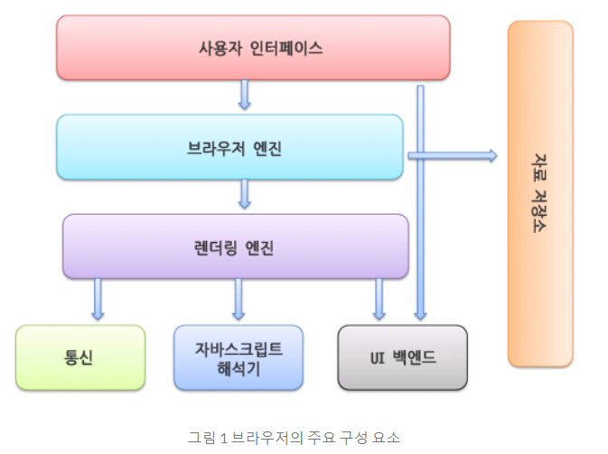
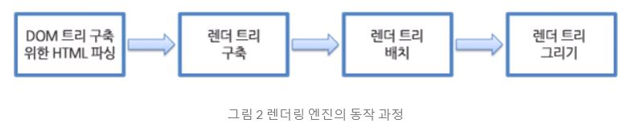
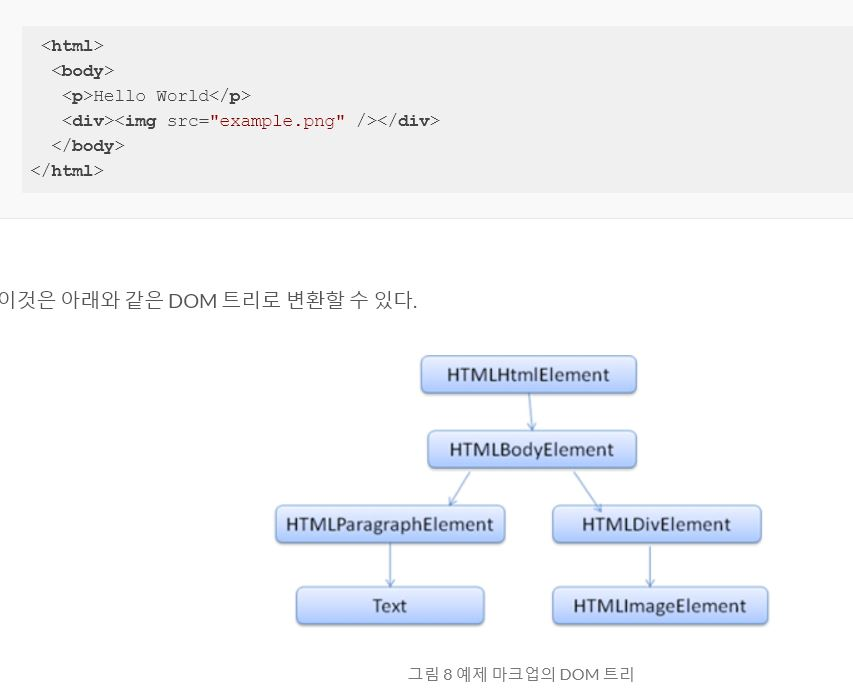
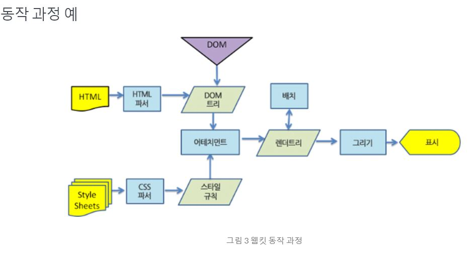
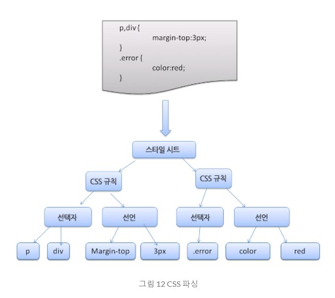
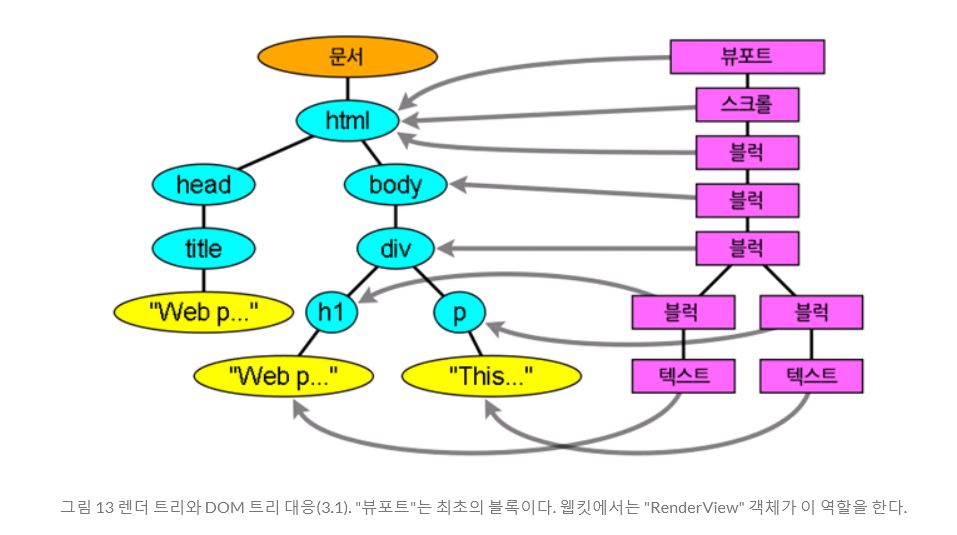

# 브라우저 도메인에 URI를 입력했을 때 어떤 과정을 거쳐 페이지가 렌더링될까?

> Open Source Brower를 기준(Crome, Firefox 등)으로 설명한다.

## 브라우저의 주요 기능 : 사용자가 선택한 자원을 서버에 요청하고 브라우저에 표시

* 자원이란 무엇인가?
    - 보통 HTML 문서, 또는 PDF나 이미지 파일 등 다양한 형태의 자원이 존재한다.
* 자원의 주소는 어떻게 정해지는가?
    - URI(Uniform Resource Identifier)에 의해 정해진다.
    - URI는 개발자가 정의한다
* 브라우저는 자원을 어떻게 해석하는가?
    - 웹 표준화 기구(W3C:World Wide Web Consortium)에서 정해진 HTML과 CSS 명세에 따라 HTML을 해석해서 표시한다. 
* 브라우저 UI는 표준화된 명세가 없다.
    - HTML5 명세는 주소 표시줄, 상태 표시줄, 도구 모음과 같은 일반적인 요소를 제외한 브라우저 필수 UI를 지정하지 않았다.
    - 다만 서로의 장점을 모방하면서 다음과 같은 일반적인 UI가 닮은 형태를 띄게 되었다.
        - URI 입력을 위한 주소 표시줄
        - 페이지 이동 이전 버튼, 다음 버튼
        - 북마크 기능
        - 새로고침 버튼과 현재 문서 로드를 중단할 수 있는 버튼
        - 홈 버튼

## 브라우저 기본 구조

브라우저의 기본 구성 요소는 다음과 같다.

1. **사용자 인터페이스(UI)** : 주소 표시줄, 이전/다음 버튼, 북마크 메뉴 등 요청한 페이지를 보여주는 창을 제외한 나머지 모든 부분(새로 렌더링 되지 않는 부분)
2. **브라우저 엔진** : 사용자 인터페이스와 렌더링 엔진 사이의 동작 제어
3. **렌더링 엔진** : 요청한 컨텐츠를 브라우저 화면에 표시, 예를 들어 HTML을 요청하면 HTML과 CSS를 파싱하여 화면에 표시
    * 크롬은 다른 브라우저들과 달리 각 탭마다 별로의 렌더링 엔진 인스턴스를 유지한다. 각 탭은 독립된 프로세스로 처리된다.
    * 렌더링 엔진은 HTML(HyperText Markup Language) 및 XML(Extensible Markup Language) 문서와 이미지를 표시할 수 있다. 또한 플러그인이나 브라우저 확장 기능을 통해 PDF와 같은 다른 유형도 표시할 수 있다.
    * 대표적으로 Webkit(웹킷) 엔진과 Gecko(게코) 엔진이 있다. 
4. **통신** : HTTP 요청과 같은 네트워크 호출에 사용됨. 이것은 플랫폼 독립적인 인터페이스이고 각 플랫폼 하부에서 실행된다.
5. **UI 백엔드** : 콤보 박스와 창 같은 기본적인 장치를 그림. 플랫폼에 명시하지 않은 일반적인 인터페이스로서, OS 사용자 인터페이스 체계를 사용한다.
6. **자바스크립트 해석기** : 자바스크립트 코드를 해석하고 실행한다.
7. **자료 저장소** : 자료를 저장하는 계층이다. 쿠키를 저장하는 것과 같이 모든 종류의 자원을 하드 디스크에 저장할 필요가 있다. HTML5 명세에는 브라우저가 지원하는 웹 데이터 베이스가 정의되어 있다.
    * 클라이언트 측 스토리지 : HTML5는 앱이 클라이언트 장치에 데이터를 저장할 수 있도록 하는 여러 기술이 있다. 또한 이는 서버에 다시 동기화되거나 클라이언트에 남아있을 수 있습니다.
        - 첫째, 사용자가 오프라인일 때 앱이 작동할 수 있도록하며 네트워크가 다시 연결되면 데이터를 다시 동기화 할 수 있다.
        - 둘째, 성능 향상, 사용자가 사이트를 다시 다운로드하지 않고 클릭하자마자 대량의 데이터를 표시할 수 있다.
        - 셋쨰, 서버 인프라가 필요없는 쉬운 프로그래밍 모델이다. 물론 보안이 취약하고 사용자는 여러 클라이언트에서 엑세스할 수 없으므로 중요하지 않은 데이터만 저장해야 한다.
    * Web Storage : 단순히 키-값 매핑(예, localStorage["name"] = username;), string-string mapping만 지원하므로 다른 데이터 구조를 직렬화 및 역직렬화해야한다. JSON.stringify() 혹은 JSON.parse()를 이용하여 수행할 수 있다.



## 렌더링 엔진의 동작 과정

- 렌더링 엔진은 통신으로부터 요청한 문서의 내용을 얻는 것으로 시작하는데 문서의 내용은 보통 8KB 단위로 전송된다.

렌더링 엔진의 기본적인 동작과정은 아래와 같다.



1. 렌더링 엔진은 HTML 문서를 파싱하고 "콘텐츠 트리" 내부에서 태그를 DOM 노드로 변환한다. 그 다음 외부 CSS 파일과 함께 포함된 스타일 요소도 파싱한다. 스타일 정보와 HTML 표시 규칙은 "렌더 트리"라고 부르는 또 다른 트리를 생성한다.
    * DOM(Document Object Model) : 
        - "파싱 트리"는 DOM 요소와 속성 노드의 트리로서 출력 트리가 된다. 
        - 이것은 **HTML 문서의 객체 표현이고 외부를 향하는 자바스크립트와 같은 HTML 요소의 연결 지점**이다. 트리의 최상위 객체는 문서이다.
        - DOM은 마크업과 1:1의 관계를 맺는다. 
        - HTML이 HTML 파서를 통해 파싱되고, DOM과 연결되어 'DOM 트리'를 형성한다.
    * "어태치먼트(attachment)"는 웹킷이 렌더 트리를 생성하기 위해 DOM 노드와 시각 정보를 연결하는 과정이다. 



2. 렌더 트리는 색상 또는 면적과 같은 시각적 속성이 있는 사각형을 포함하고 있는데 정해진 순서대로 화면에 표시된다.

3. 렌더 트리 생성이 끝나면 배치가 시작되는데 이것은 각 노드가 화면의 정확한 위치에 표시되는 것을 의미한다. 다음은 UI 백엔드에서 렌더 트리의 각 노드를 가로지르며 형상을 만들어 내는 그리기 과정이다.

4. 일련의 과정들이 점진적으로 진행된다는 것을 아는 것이 중요하다. 렌더링 엔진은 좀 더 나은 사용자 경험을 위해 가능하면 빠르게 내용을 표시하는데 모든 HTML을 파싱할 때까지 기다리지 않고 배치와 그리기 과정을 시작한다. 네트워크로부터 나머지 내용이 전송되기를 기다리는 동시에 받은 내용의 일부를 먼저 화면에 표시하는 것이다.



### 파싱이란? 

문서 파싱은 **브라우저가 코드를 이해하고 사용할 수 있는 구조로 변환하는 것**을 의미한다. **파싱 결과는 보통 문서 구조를 나타내는 노드 트리**인데 파싱 트리(parse tree) 또는 문법 트리(syntax tree)라고 부른다.

- **문법** : 파싱은 문서에 작성된 언어 또는 형식의 규칙에 따르는데 파싱할 수 있는 모든 형식은 정해진 용어와 구문 규칙에 따라야 한다. 이것을 문맥 자유 문법이라고 한다. 인간의 언어는 이런 모습과는 다르기 때문에 기계적으로 파싱이 불가능하다.
- **구분** : 어휘 분석 vs 구문 분석
    - 어휘 분석 : 자료를 토큰으로 분해하는 과정
        - 토큰 : 유효하게 구성된 단위의 집합체로 용어집이라고도 할 수 있다. 사전에 등장하는 모든 단어에 해당한다.
        - 어휘는 보통 정규표현식으로 표현한다.
    - 구문 분석 : 언어의 구문 규칙을 적용하는 과정
        - 구문은 보통 BNF(Backus–Naur form) 형식에 따라 정의한다. `<기호> ::= <표현식>`
- **과정** : 파서는 보통 두 가지 일을 하는데 자료를 유효한 토큰으로 분해하는 어휘 분석기(토큰 변환기라고도 부름)가 있고 언어 구문 규칙에 따라 문서 구조를 분석함으로써 파싱 트리를 생성하는 파서가 있다. 어휘 분석기는 공백과 줄 바꿈 같은 의미 없는 문자를 제거한다.
    - 문서 소스로부터 파싱 트리를 만드는 과정 : 문서 -> 어휘분석 -> 구문분석 -> 파싱트리
    - 파서의 종류 :
        - 상향식 파서(이동-감소 파서) : 
            - 입력 값의 오른쪽으로 이동하면서(입력 값의 처음을 가리키는 포인터가 오른쪽으로 이동하는 것을 상상) 구문 규칙으로 갈수록 남는 것이 점차 감소
            - 입력 값이 규칙에 맞을 때까지 찾아서 맞는 입력 값을 규칙으로 바꾸는데 이 과정은 입력 값의 끝까지 진행된다. 부분적으로 일치하는 표현식은 파서 스택에 쌓인다.
        - 하향식 파서 : 가장 높은 수준의 규칙(구문의 상위 구조)로부터 일치하는 것을 먼저 찾는 것으로부터 시작한다.
        - 파서 자동 생성 : **파서 생성기** 
            - 웹킷의 파서 생성기 : 
                - 어휘 생성 : 플렉스(Flex) - 토큰의 정규 표현식 정의를 포함하는 파일을 입력 받는다.
                - 파서 생성 : 바이슨(Bison) - BNF 형식의 언어 구문 규칙을 입력 받는다.
        - **HTML 파서** : HTML 마크업을 파싱 트리로 변환한다.(전통적인 파서로는 HTML을 파싱할 수 없다.)
            - HTML은 파싱하기 어렵고 전통적인 구문 분석이 불가능하기 때문에 문맥 자유 문법이 아니라는 것이다. XML 파서로도 파싱하기 쉽지 않다. 
            - HTML 파싱 알고리즘은 복잡하기 때문에 다음에 다루도록 한다.
- **반복** : 파싱 과정은 반복된다. 파서는 보통 어휘 분석기로부터 새 토큰을 받아서 구문 규칙과 일치하는지 확인한다. 규칙에 맞으면 토큰에 해당하는 노드가 파싱 트리에 추가되고 파서는 또 다른 토큰을 요청한다.
규칙에 맞지 않으면 파서는 토큰을 내부적으로 저장하고 토큰과 일치하는 규칙이 발견될 때까지 요청한다. 맞는 규칙이 없는 경우 예외로 처리하는데 이것은 문서가 유효하지 않고 구문 오류를 포함하고 있다는 의미다.
- **변환** : 파서 트리는 최종 결과물이 아니다. 파싱은 보통 문서를 다른 양식으로 변환하는데 컴파일이 하나의 예가 된다. 소스 코드를 기계 코드로 만드는 컴파일러는 파싱 트리 생성 후 이를 기계 코드 문서로 변환한다. (소스코드 -> 파싱 -> 파싱트리 -> 변환 -> 기계코드)

#### CSS 파싱

- CSS는 문맥 자유 문법이다.(CSS 명세는 CSS 어휘와 문법을 정의하고 있다.) 몇 가지 예로 어휘 문법은 각 토큰을 위한 정규 표현식으로 정의되어 있다. 구문 문법은 BNF로 설명되어 있다.
```
omment   \/*[^]*+([^/][^]*+)\/
num        [0-9]+|[0-9]"."[0-9]+
nonascii    [\200-\377]
nmstart    [_a-z]|{nonascii}|{escape}
nmchar    [_a-z0-9-]|{nonascii}|{escape}
name        {nmchar}+
ident(identifier)        {nmstart}{nmchar}
```
- **웹킷 CSS 파서**
웹킷은 CSS 문법 파일로부터 자동으로 파서를 생성하기 위해 플렉스와 바이슨 파서 생성기를 사용한다. 파서 소개에서 언급했던 것처럼 바이슨은 상향식 이동 감소 파서를 생성한다. 각 CSS 파일은 스타일 시트 객체로 파싱되고 각 객체는 CSS 규칙을 포함한다. CSS 규칙 객체는 선택자와 선언 객체 그리고 CSS 문법과 일치하는 다른 객체를 포함한다.   



- **스크립트**
웹은 파싱과 실행이 동시에 수행되는 동기화(synchronous) 모델이다. < script > 태그를 만나면 스크립트가 실행되는 동안 문서의 파싱은 중단된다. 스크립트가 외부에 있는 경우 우선 네트워크로부터 자원을 가져와야 하는데 이 또한 실시간으로 처리되고 자원을 받을 때까지 파싱은 중단된다. 제작자는 스크립트를 "지연(defer)"으로 표시할 수 있는데 지연으로 표시하게 되면 문서 파싱은 중단되지 않고 문서 파싱이 완료된 이후에 스크립트가 실행된다. HTML5는 스크립트를 비동기(asynchronous)로 처리하는 속성을 추가했기 때문에 별도의 맥락에 의해 파싱되고 실행된다.

- **스타일 시트**
한편 스타일 시트는 다른 모델을 사용한다. 이론적으로 스타일 시트는 DOM 트리를 변경하지 않기 때문에 문서 파싱을 기다리거나 중단할 이유가 없다. 그러나 **스크립트가 문서를 파싱하는 동안 스타일 정보를 요청하는 경우라면 문제가 된다.** 스타일이 파싱되지 않은 상태라면 스크립트는 잘못된 결과를 내놓기 때문에 많은 문제를 야기한다. 웹킷은 로드되지 않은 스타일 시트 가운데 문제가 될만한 속성이 있을 때에만 스크립트를 중단한다.

## 렌더 트리 구축

DOM 트리가 구축되는 동안 브라우저는 렌더 트리를 구축한다. 표시해야 할 순서와 문서의 시각적인 구성 요소로써 올바른 순서로 내용을 그려낼 수 있도록 하기 위한 목적이 있다.

- 웹킷은 이 구성 요소를 "렌더러(renderer)" 또는 "렌더 객체(render object)"라는 용어를 사용한다.
    - 자신과 자식 요소를 어떻게 배치하고 그려내야 하는지 알고 있다.
    - 각 렌더러는 CSS2 명세에 따라 노드의 CSS 박스에 부합하는 사각형을 표시한다. 렌더러는 너비, 높이 그리고 위치와 같은 기하학적 정보를 포함한다. 

- DOM 트리와 렌더 트리의 관계
**렌더러는 DOM 요소에 부합하지만 1:1로 대응하는 관계는 아니다.** 예를 들어 "head" 요소와 같은 **비시각적 DOM 요소**는 렌더 트리에 추가되지 않는다. 또한 **display 속성에 "none" 값이 할당**된 요소는 트리에 나타나지 않는다(visibility 속성에 "hidden" 값이 할당된 요소는 트리에 나타난다).   
여러 개의 시각 객체와 대응하는 DOM 요소도 있는데 이것들은 보통 하나의 사각형으로는 묘사할 수 없는 복잡한 구조다. 예를 들면 "select" 요소는 '표시 영역, 드롭다운 목록, 버튼' 표시를 위한 3개의 렌더러가 있다. 또한 한 줄에 충분히 표시할 수 없는 문자가 여러 줄로 바뀔 때 새 줄은 별도의 렌더러로 추가된다. 여러 렌더러와 대응하는 또 다른 예는 깨진 HTML이다. CSS 명세에 의하면 인라인 박스는 블록 박스만 포함하거나 인라인 박스만을 포함해야 하는데 인라인과 블록 박스가 섞인 경우 인라인 박스를 감싸기 위한 익명의 블록 렌더러가 생성된다.   
어떤 렌더 객체는 DOM 노드에 대응하지만 트리의 동일한 위치에 있지 않다. float 처리된 요소 또는 position 속성 값이 absolute로 처리된 요소는 흐름에서 벗어나 트리의 다른 곳에 배치된 상태로 형상이 그려진다. 대신 자리 표시자가 원래 있어야 할 곳에 배치된다.



- 트리를 구축하는 과정
웹킷에서는 스타일을 결정하고 렌더러를 만드는 과정을 "어태치먼트(attachment)" 라고 부른다. 모든 DOM 노드에는 "attach" 메서드가 있다. 어태치먼트는 동기적인데 DOM 트리에 노드를 추가하면 새 노드의 "attach" 메서드를 호출한다.   
html 태그와 body 태그를 처리함으로써 렌더 트리 루트를 구성한다. 루트 렌더 객체는 CSS 명세에서 포함 블록(다른 모든 블록을 포함하는 최상위 블록)이라고 부르는 그것과 일치한다. 웹킷은 RenderView라고 부른다. 이것이 문서가 가리키는 렌더 객체다. 트리의 나머지 부분은 DOM 노드를 추가함으로써 구축된다.

## 배치 

- 렌더러가 생성되어 트리에 추가될 때 크기와 위치 정보는 없는데 이런 값을 계산하는 것을 배치 또는 리플로라고 부른다.
    - 배치는 반복되며 HTML 문서의 `<html>` 요소에 해당하는 최상위 렌더러에서 시작한다. 배치는 프레임 계층의 일부 또는 전부를 통해 반복되고 각 렌더러에 필요한 크기와 위치 정보를 계산한다.
    - 최상위 렌더러의 위치는 0,0 이고 브라우저 창의 보이는 영역에 해당하는 뷰포트 만큼의 면적을 갖는다.
    - 모든 렌더러는 "배치" 또는 "리플로" 메서드를 갖는데 각 렌더러는 배치해야 할 자식의 배치 메소드를 불러온다.
- 더티 비트 체제 : 소소한 변경 때문에 전체를 다시 배치하지 않기 위해 브라우저는 "더티 비트" 체제를 사용
    - 렌더러는 다시 배치할 필요가 있는 변경 요소 또는 추가된 것과 그 자식을 "더티"라고 표시한다.
    - "더티"와 "자식이 더티" 이렇게 두 가지 플래그가 있다. 자식이 더터하다는 것은 본인은 괜찮지만 자식 가운데 적어도 하나를 다시 배치할 필요가 있다는 의미다.
- 전역배치와 점증배치
    - 전역배치 : 렌더러 트리 전체에서 일어나는 배치, 다음의 경우 발생한다.(동기적으로 실행)
        - 글꼴 크기 변경과 같이 모든 렌더러에 영향을 주는 전역 스타일 변경
        - 화면 크기 변경에 의한 결과.
    - 점증배치 : 렌더러가 더티일 때 비동기적으로 일어난다.
        - 네트워크로부터 추가 내용을 받아서 DOM 트리에 더해진 다음 새로운 렌더러가 렌더 트리에 붙을 때이다.
- 배치 과정
    - 부모 렌더러가 자신의 너비를 결정
    - 부모가 자식을 검토
        - 자식 렌더러를 배치(자식의 x와 y를 설정)
        - (부모와 자식이 더티하거나 전역 배치 상태이거나 또는 다른 이유로) 필요하다면 자식 배치를 호출하여 자식의 높이를 계산한다.
    - 부모는 자식의 누적된 높이와 여백, 패딩을 사용하여 자신의 높이를 설정한다. 이 값은 부모 렌더러의 부모가 사용하게 된다.
    - 더티 비트 플래그를 제거한다.